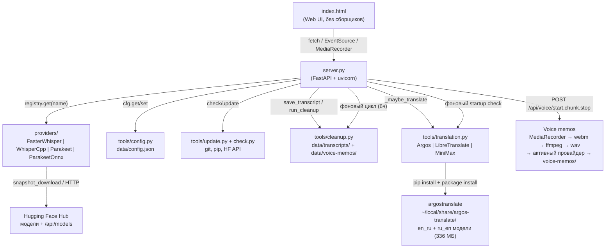

<!-- generated-by: gsd-doc-writer -->
# Архитектура Autrau

## Обзор системы

Autrau — локальный веб-сервер транскрибации аудио, работающий **одним процессом**. FastAPI-приложение (`server.py`) раздаёт одностраничный UI (`index.html`) и JSON/SSE-API, а вся обработка речи делегируется одному из четырёх **провайдеров** (faster-whisper, whisper.cpp, Parakeet NeMo, Parakeet v3 ONNX), скрытых за общим абстрактным интерфейсом. Опционально — **автоперевод** на английский через `tools/translation.py` (Argos Translate локально / LibreTranslate HTTP / MiniMax API). Поддерживаются **голосовые заметки** через `MediaRecorder` (браузер) + ffmpeg-склейку. Данные хранятся локально: конфигурация (`data/config.json`), архив расшифровок (`data/transcripts/`), голосовые заметки (`data/voice-memos/`), скачанные модели (`data/models/`). Ничего не уходит в облако — только GET-запросы к `huggingface.co/api/models/<repo>` при проверке обновлений моделей и скачивание самих моделей.

Архитектурный стиль: монолит уровня «один файл-сервер + пакеты ответственности», с плагинной моделью провайдеров и событийным (SSE) интерфейсом между сервером и UI.

## Схема компонентов



## Потоки данных

### Транскрибация (`POST /transcribe`)

1. `server.py` принимает `multipart/form-data` (файл + `language` + опционально `provider`/`model`/`device`).
2. Провайдер/модель/устройство определяются из запроса или из конфига; неизвестный провайдер → `404`, не установленный → `412`.
3. Модель **лениво** загружается в память под `asyncio.Lock` (`_loaded_lock`); в памяти одновременно держится только одна модель (`_loaded_provider/_loaded_model/_loaded_device`).
4. Загруженный файл сохраняется во временный файл (`tempfile.NamedTemporaryFile`), транскрибация запускается в потоке через `loop.run_in_executor`.
5. Провайдер вызывает `on_segment(segment, percent)` — сервер кладёт события в `asyncio.Queue`, SSE-генератор отдаёт их клиенту (`{type: progress|done|error, percent, payload}`).
6. По завершении результат (`text`, `segments`, `info`) сохраняется в `data/transcripts/` через `clean.save_transcript(...)`, временный файл удаляется.
7. Если `translate_to_en=true` — вызывается `_maybe_translate(text, info, target_path)`: подключается провайдер из `tools/translation.py` (Argos/LibreTranslate/MiniMax), создаётся `<name>.en.txt` рядом. Ошибка перевода не ломает основной поток (логируется warning, оригинал остаётся).

### Голосовые заметки (`POST /api/voice/{start,chunk,stop}`)

1. UI: `Ctrl+Shift+R` (или кнопка «🔴 Записать») → `navigator.mediaDevices.getUserMedia({audio: true})` + `MediaRecorder` (`audio/webm;codecs=opus`, `timeslice: 500`).
2. Каждые 500 мс фронт шлёт чанк: `POST /api/voice/chunk` (multipart `id` + `chunk`). Сервер копит байты в `_voice_sessions[id]["chunks"]` под `_voice_lock`.
3. `POST /api/voice/stop` (body `{id, language?}`): склейка чанков в webm → `ffmpeg -i … -ac 1 -ar 16000 out.wav` → транскрибация активным провайдером (тот же пайплайн что и `/transcribe`) → сохранение в `data/voice-memos/<timestamp>.txt` с шапкой `# Тип: голосовая заметка / # Модель: ... / # Язык: ...`. Опция `_cancel: true` дропает сессию без транскрипции.
4. Hotkey работает только когда вкладка в фокусе (in-browser). Глобальный хоткей — это `v1.6 portable exe` (Electron/Tauri/PyInstaller).

### Автоперевод (`tools/translation.py`)

`TranslationProvider` (ABC) → `ArgosTranslateProvider` / `LibreTranslateProvider` / `MiniMaxProvider`. `tr.translate(text, target, provider, fallback)` пробует primary → fallback; бросает `RuntimeError` если оба не сработали.

**Argos Translate (локально, v1.5.1+):**
- Пакет: `pip install argostranslate langdetect` (в venv сервера)
- Модели: 100+ пар в индексе `https://raw.githubusercontent.com/argosopentech/argospm-index/main/`. По умолчанию скачиваются `translate-en_ru` (187 МБ) + `translate-ru_en` (149 МБ) = 336 МБ, в `~/local/share/argos-translate/packages/` (общая папка, не дублируется для system Python и venv).
- Реальный URL моделей: `https://argos-net.com/v1/<...>.argosmodel` (⚠️ НЕ `argosopentech.com` — мёртв с 2024).
- `is_available()` проверяет наличие обеих моделей через `package.get_installed_packages()` (без загрузки в RAM).
- `translate()` использует `langdetect` для определения языка + `argostranslate.translate.get_translation_from_codes(from, to)`. Cyrillic-эвристика как fallback если `langdetect` отсутствует.
- Первый перевод ~20-30 сек (модель грузится в RAM), последующие ~1-5 сек.

**Установка через UI:** `POST /api/translate/install-argos` — pip install + обновление индекса + скачивание обеих моделей в фоне. Следить за `/api/translate/providers` — когда `argos.available=true`, всё готово.

**Проверка при старте:** `_translation_startup_check()` логирует ✓/✗ для каждого провайдера (с таймаутом 5с, чтобы `is_available()` не зависал). Также вызывается из UI при загрузке страницы → обновляются badge'ы в hero (`✓ Argos` / `✗ Argos` / `🔁 Автоперевод: ВКЛ/выкл`).

### Проверка обновлений (`GET /api/updates`)

`tools/update.check_all_updates()`: проверка приложения (`git fetch` + `rev-list`) + по каждому провайдеру GET-запрос к `huggingface.co/api/models/<repo>` для каждой модели (3 модели → ~5 секунд). `?stream=1` отдаёт SSE-события прогресса по каждой модели (`{done, total, label, percent}`) с финальным `done`.

### Авто-очистка (`tools/cleanup.py`)

Фоновый цикл `_cleanup_loop()` запускается при старте сервера и раз в 6 часов: если `cleanup_after_days > 0`, удаляет расшифровки старше N дней (по `st_mtime`); для голосовых заметок — отдельный лимит `voice_memo_cleanup_after_days`. Избранные (★) не удаляются в обоих случаях. Ручной запуск — `POST /api/cleanup` с телом `{"days": N}`.

## Ключевые абстракции

| Абстракция | Файл | Назначение |
|---|---|---|
| `Provider` (ABC) | `providers/base.py:53` | Единый контракт провайдера: `is_available`, `install`, `list_models`, `is_model_downloaded`, `download_model`, `check_model_update`, `load`, `transcribe` |
| `ProviderRegistry` | `providers/base.py:105` | Реестр синглтонов провайдеров; `get(name)` бросает `KeyError` для неизвестных имён |
| `ProviderInfo` (dataclass) | `providers/base.py:24` | Статичная метадата провайдера (модели, языки, hint установки) — поверхностно в UI |
| `Segment` (dataclass) | `providers/base.py:40` | Сегмент распознанной речи `{start, end, text}` |
| `SegmentCallback` | `providers/base.py:50` | `Callable[[Segment, int], None]` — обратный вызов прогресса транскрибации |
| `cfg` (модуль) | `tools/config.py` | Тред-безопасный доступ к `data/config.json` (`init/get/set/all/save`) |
| `clean.run_cleanup` | `tools/cleanup.py:66` | Возрастная очистка расшифровок + голосовых заметок, возвращает сводку `{deleted, kept, freed_mb, protected}` |
| `tr.TranslationProvider` (ABC) | `tools/translation.py:42` | Единый контракт провайдера перевода: `is_available`, `translate(text, source, target)` |
| `tr.ArgosTranslateProvider` | `tools/translation.py:56` | Локальный перевод через argostranslate (en↔ru, 336 МБ) с `langdetect` + Cyrillic-эвристикой |
| `tr.LibreTranslateProvider` | `tools/translation.py:160` | HTTP-перевод через публичный или self-hosted LibreTranslate |
| `tr.MiniMaxProvider` | `tools/translation.py:188` | OpenAI-compatible chat completion через MiniMax API (платный) |
| `tr.translate()` | `tools/translation.py:288` | Fallback chain (primary → fallback), возвращает `(text, provider_name)` |
| `clean.save_transcript` / `save_voice_memo` / `save_translated` | `tools/cleanup.py` | Сохранение транскрипта / голосовой заметки / перевода с заголовком |

Добавление нового провайдера = новый подкласс `Provider` + авторегистрация в `providers/__init__.py`; UI и API не меняются.

## Модель потоков

- **Основной цикл:** asyncio (uvicorn), все эндпоинты — `async def`.
- **Тяжёлая работа** (загрузка модели, транскрибация, скачивание, проверка обновлений) — в потоках через `loop.run_in_executor`; результат в UI доставляется через `asyncio.Queue` + SSE.
- **Конфигурация** защищена `threading.RLock` (`tools/config.py`).
- **Загрузка моделей** сериализована `asyncio.Lock` (одна модель в памяти; повторный `load` того же `(model, device)` идемпотентен).

## Обоснование структуры каталогов

```
server.py              # единственная точка входа: API + раздача UI + фоновые циклы
index.html             # UI без сборщиков — открывается сервером, не файлом
providers/             # изоляция бэкендов распознавания за общим ABC
tools/                 # боковая инфраструктура: config / check / update / cleanup / translation
data/                  # рантайм-данные (gitignored): config.json, transcripts/, voice-memos/, models/
docs/                  # документация
*.bat                  # Windows-обёртки: start / update / publish
```

Плоская структура выбрана осознанно: проект — локальный инструмент без сборки и деплоя; всё, что можно, живёт в одном процессе, а расширяемость обеспечивает плагинный реестр провайдеров и ABC переводчиков, а не многослойность пакетов.
