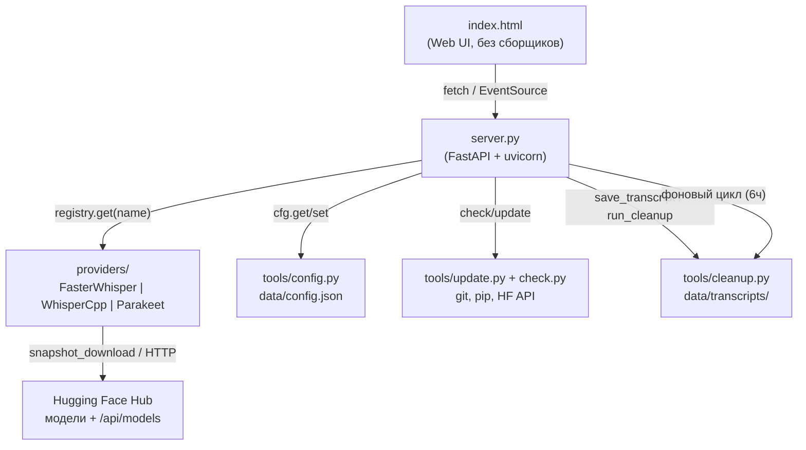

<!-- generated-by: gsd-doc-writer -->
# Архитектура Autrau

## Обзор системы

Autrau — локальный веб-сервер транскрибации аудио, работающий **одним процессом**. FastAPI-приложение (`server.py`) раздаёт одностраничный UI (`index.html`) и JSON/SSE-API, а вся обработка речи делегируется одному из трёх **провайдеров** (faster-whisper, whisper.cpp, Parakeet), скрытых за общим абстрактным интерфейсом. Данные хранятся локально: конфигурация (`data/config.json`), архив расшифровок (`data/transcripts/`), скачанные модели (`data/models/`). Ничего не уходит в облако — только GET-запросы к `huggingface.co/api/models/<repo>` при проверке обновлений моделей и скачивание самих моделей.

Архитектурный стиль: монолит уровня «один файл-сервер + пакеты ответственности», с плагинной моделью провайдеров и событийным (SSE) интерфейсом между сервером и UI.

## Схема компонентов



## Потоки данных

### Транскрибация (`POST /transcribe`)

1. `server.py` принимает `multipart/form-data` (файл + `language` + опционально `provider`/`model`/`device`).
2. Провайдер/модель/устройство определяются из запроса или из конфига; неизвестный провайдер → `404`, не установленный → `412`.
3. Модель **лениво** загружается в память под `asyncio.Lock` (`_loaded_lock`); в памяти одновременно держится только одна модель (`_loaded_provider/_loaded_model/_loaded_device`).
4. Загруженный файл сохраняется во временный файл (`tempfile.NamedTemporaryFile`), транскрибация запускается в потоке через `loop.run_in_executor`.
5. Провайдер вызывает `on_segment(segment, percent)` — сервер кладёт события в `asyncio.Queue`, SSE-генератор отдаёт их клиенту (`{type: progress|done|error, percent, payload}`).
6. По завершении результат (`text`, `segments`, `info`) сохраняется в `data/transcripts/` через `clean.save_transcript(...)`, временный файл удаляется.

### Проверка обновлений (`GET /api/updates`)

`tools/update.check_all_updates()`: проверка приложения (`git fetch` + `rev-list`) + по каждому провайдеру GET-запрос к `huggingface.co/api/models/<repo>` для каждой модели (22 модели → ~15 секунд). `?stream=1` отдаёт SSE-события прогресса по каждой модели (`{done, total, label, percent}`) с финальным `done`.

### Авто-очистка (`tools/cleanup.py`)

Фоновый цикл `_cleanup_loop()` запускается при старте сервера и раз в 6 часов: если `cleanup_after_days > 0`, удаляет расшифровки старше N дней (по `st_mtime`). Ручной запуск — `POST /api/cleanup` с телом `{"days": N}`.

## Ключевые абстракции

| Абстракция | Файл | Назначение |
|---|---|---|
| `Provider` (ABC) | `providers/base.py:53` | Единый контракт провайдера: `is_available`, `install`, `list_models`, `is_model_downloaded`, `download_model`, `check_model_update`, `load`, `transcribe` |
| `ProviderRegistry` | `providers/base.py:105` | Реестр синглтонов провайдеров; `get(name)` бросает `KeyError` для неизвестных имён |
| `ProviderInfo` (dataclass) | `providers/base.py:24` | Статичная метадата провайдера (модели, языки, hint установки) — поверхностно в UI |
| `Segment` (dataclass) | `providers/base.py:40` | Сегмент распознанной речи `{start, end, text}` |
| `SegmentCallback` | `providers/base.py:50` | `Callable[[Segment, int], None]` — обратный вызов прогресса транскрибации |
| `cfg` (модуль) | `tools/config.py` | Тред-безопасный доступ к `data/config.json` (`init/get/set/all/save`) |
| `clean.run_cleanup` | `tools/cleanup.py:66` | Возрастная очистка расшифровок, возвращает сводку `{deleted, kept, freed_mb}` |

Добавление нового провайдера = новый подкласс `Provider` + авторегистрация в `providers/__init__.py`; UI и API не меняются.

## Модель потоков

- **Основной цикл:** asyncio (uvicorn), все эндпоинты — `async def`.
- **Тяжёлая работа** (загрузка модели, транскрибация, скачивание, проверка обновлений) — в потоках через `loop.run_in_executor`; результат в UI доставляется через `asyncio.Queue` + SSE.
- **Конфигурация** защищена `threading.RLock` (`tools/config.py`).
- **Загрузка моделей** сериализована `asyncio.Lock` (одна модель в памяти; повторный `load` того же `(model, device)` идемпотентен).

## Обоснование структуры каталогов

```
server.py          # единственная точка входа: API + раздача UI + фоновые циклы
index.html         # UI без сборщиков — открывается сервером, не файлом
providers/         # изоляция бэкендов распознавания за общим ABC
tools/             # боковая инфраструктура: config / check / update / cleanup
data/              # рантайм-данные (gitignored): config.json, transcripts/, models/
docs/              # документация
*.bat              # Windows-обёртки: start / update / publish
```

Плоская структура выбрана осознанно: проект — локальный инструмент без сборки и деплоя; всё, что можно, живёт в одном процессе, а расширяемость обеспечивает плагинный реестр провайдеров, а не многослойность пакетов.
