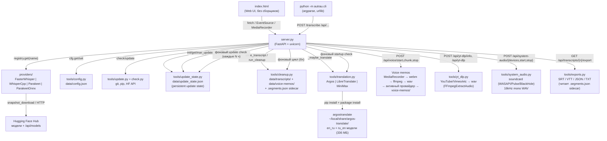

<!-- generated-by: gsd-doc-writer -->
# Архитектура Autrau

## Обзор системы

Autrau — локальный веб-сервер транскрибации аудио, работающий **одним процессом**. FastAPI-приложение (`server.py`) раздаёт одностраничный UI (`index.html`) и JSON/SSE-API, а вся обработка речи делегируется одному из четырёх **провайдеров** (faster-whisper, whisper.cpp, Parakeet NeMo, Parakeet v3 ONNX), скрытых за общим абстрактным интерфейсом. Опционально — **автоперевод** на английский через `tools/translation.py` (Argos Translate локально / LibreTranslate HTTP / MiniMax API). Поддерживаются **голосовые заметки** через `MediaRecorder` (браузер) + ffmpeg-склейку. Дополнительно с v1.5.7: **CLI-инструмент** (`python -m autrau.cli`), **URL → транскрипция** через `yt-dlp`, **захват системного аудио** (loopback) через `soundcard`. С v1.5.8 — **real self-update** с persistent state, background scheduler и UI-баннером.

Данные хранятся локально: конфигурация (`data/config.json`), update-state (`data/update_state.json`), архив расшифровок (`data/transcripts/`), голосовые заметки (`data/voice-memos/`), скачанные модели (`data/models/`), sidecar-файлы сегментов (`<stem>.segments.json` рядом с `.txt` для SRT/VTT/JSON-экспорта). Ничего не уходит в облако — только GET-запросы к `huggingface.co/api/models/<repo>` при проверке обновлений моделей, скачивание самих моделей и `git fetch origin main` для проверки обновлений приложения.

Архитектурный стиль: монолит уровня «один файл-сервер + пакеты ответственности», с плагинной моделью провайдеров и событийным (SSE) интерфейсом между сервером и UI.

## Схема компонентов



## Потоки данных

### Транскрибация (`POST /transcribe`)

1. `server.py` принимает `multipart/form-data` (файл + `language` + опционально `provider`/`model`/`device`).
2. Провайдер/модель/устройство определяются из запроса или из конфига; неизвестный провайдер → `404`, не установленный → `412`.
3. Модель **лениво** загружается в память под `asyncio.Lock` (`_loaded_lock`); в памяти одновременно держится только одна модель (`_loaded_provider/_loaded_model/_loaded_device`).
4. Загруженный файл сохраняется во временный файл (`tempfile.NamedTemporaryFile`), транскрибация запускается в потоке через `loop.run_in_executor`.
5. Провайдер вызывает `on_segment(segment, percent)` — сервер кладёт события в `asyncio.Queue`, SSE-генератор отдаёт их клиенту (`{type: progress|done|error, percent, payload}`).
6. По завершении результат (`text`, `segments`, `info`) сохраняется в `data/transcripts/` через `clean.save_transcript(..., segments=...)`. Если переданы `segments` — дополнительно пишется sidecar `<stem>.segments.json` (version, language, provider, model, duration, segments) — для последующего экспорта в SRT/VTT/JSON без ре-транскрибации. Временный файл удаляется.
7. Если `translate_to_en=true` — вызывается `_maybe_translate(text, info, target_path)`: подключается провайдер из `tools/translation.py` (Argos/LibreTranslate/MiniMax), создаётся `<name>.en.txt` рядом. Ошибка перевода не ломает основной поток (логируется warning, оригинал остаётся).

Финальный SSE `done` event дополнительно содержит поле `file` — имя сохранённого `.txt` (для последующего `GET /api/transcripts/{name}/export` из CLI или UI).

### Голосовые заметки (`POST /api/voice/{start,chunk,stop}`)

1. UI: `Ctrl+Shift+R` (или кнопка «🔴 Записать») → `navigator.mediaDevices.getUserMedia({audio: true})` + `MediaRecorder` (`audio/webm;codecs=opus`, `timeslice: 500`).
2. Каждые 500 мс фронт шлёт чанк: `POST /api/voice/chunk` (multipart `id` + `chunk`). Сервер копит байты в `_voice_sessions[id]["chunks"]` под `_voice_lock`.
3. `POST /api/voice/stop` (body `{id, language?}`): склейка чанков в webm → `ffmpeg -i … -ac 1 -ar 16000 out.wav` → транскрибация активным провайдером (тот же пайплайн что и `/transcribe`) → сохранение в `data/voice-memos/<timestamp>.txt` через `clean.save_voice_memo(..., segments=...)` (тоже с sidecar) + опционально `<timestamp>.en.txt`. Опция `_cancel: true` дропает сессию без транскрипции.
4. Hotkey работает только когда вкладка в фокусе (in-browser). Глобальный хоткей — это `v1.6 portable exe` (Electron/Tauri/PyInstaller).

### Автоперевод (`tools/translation.py`)

`TranslationProvider` (ABC) → `ArgosTranslateProvider` / `LibreTranslateProvider` / `MiniMaxProvider`. `tr.translate(text, target, provider, fallback)` пробует primary → fallback; бросает `RuntimeError` если оба не сработали.

**Argos Translate (локально, v1.5.1+):**
- Пакет: `pip install argostranslate langdetect` (в venv сервера)
- Модели: 100+ пар в индексе `https://raw.githubusercontent.com/argosopentech/argospm-index/main/`. По умолчанию скачиваются `translate-en_ru` (187 МБ) + `translate-ru_en` (149 МБ) = 336 МБ, в `~/local/share/argos-translate/packages/` (общая папка, не дублируется для system Python и venv).
- Реальный URL моделей: `https://argos-net.com/v1/<...>.argosmodel` (⚠️ НЕ `argosopentech.com` — мёртв с 2024).
- `is_available()` проверяет наличие обеих моделей через `package.get_installed_packages()` (без загрузки в RAM).
- `translate()` использует `langdetect` для определения языка + `argostranslate.translate.get_translation_from_codes(from, to)`. Cyrillic-эвристика как fallback если `langdetect` отсутствует.
- Первый перевод ~20-30 сек (модель грузится в RAM), последующие ~1-5 сек.

**Установка через UI:** `POST /api/translate/install-argos` — pip install + обновление индекса + скачивание обеих моделей в фоне. Следить за `/api/translate/providers` — когда `argos.available=true`, всё готово.

**Проверка при старте:** `_translation_startup_check()` логирует ✓/✗ для каждого провайдера (с таймаутом 5с, чтобы `is_available()` не зависал). Также вызывается из UI при загрузке страницы → обновляются badge'ы в hero (`✓ Argos` / `✗ Argos` / `🔁 Автоперевод: ВКЛ/выкл`).

### URL → транскрипция (`tools/yt_dlp.py`, v1.5.7)

`yt-dlp` обёртка для ~1500 поддерживаемых сайтов (YouTube, Vimeo, X/Twitter, Facebook, Twitch, SoundCloud, Reddit и др.).

1. `GET /api/yt-dlp/info?url=...` — probe через `yt_dlp.YoutubeDL(skip_download=True)` → возвращает `{title, duration, thumbnail, uploader, webpage_url}`. Ошибки yt-dlp стрипятся от ANSI-кодов (`\x1b\[[0-9;]*m`) и возвращаются как `400` с понятным сообщением.
2. `POST /api/yt-dlp {url, language?, provider?, model?}` — SSE stream:
   - `info` event с метаданными видео
   - `downloading` events с процентом (через `progress_hooks`)
   - `transcribing` events во время `/transcribe` через тот же пайплайн
   - `done` с результатом
3. Скачивание: `bestaudio[ext=m4a]/bestaudio[ext=webm]/bestaudio/best` → postprocessor `FFmpegExtractAudio` → WAV (lossless). Сохраняется в `data/transcripts/_yt-dlp/<title>.wav`, затем обрабатывается как обычный файл.
4. Зависимость: `pip install yt-dlp` (~3.2 МБ wheel, без ffmpeg-ассетов).

### Системный звук / loopback (`tools/system_audio.py`, v1.5.7)

`soundcard` обёртка для cross-platform loopback (Windows WASAPI / macOS BlackHole / Linux PulseAudio monitor).

1. `GET /api/system-audio/devices` — список loopback-устройств через `soundcard.all_microphones(include_loopback=True)` → `[{id, name}, ...]`.
2. `POST /api/system-audio/start {device_id}` — запуск `SystemAudioRecorder` в фоновом `threading.Thread` (16kHz mono, 100ms чанки). Single-instance lock — параллельный start → `409 Conflict`.
3. `POST /api/system-audio/stop {save_to?}` — `stop_event.set()` + `thread.join(timeout=15)` → WAV сохраняется во временный файл → транскрибируется активным провайдером → результат в `data/transcripts/` или `data/voice-memos/` (если `save_to=voice-memos`). SSE stream `info → done` (с текстом и сегментами) или `error`.
4. Зависимость: `pip install soundcard` (CFFI-based, ~несколько МБ).
5. **Gotcha:** soundcard thread держит GIL во время numpy-операций; start endpoint может отвечать с задержкой ~0.5с — это не deadlock, нормальное поведение.

### Экспорт субтитров (`tools/exports.py`, v1.5.6)

`GET /api/transcripts/{name}/export?format=srt|vtt|json|txt` — конвертация сохранённых сегментов в стандартные форматы без ре-транскрибации.

1. Если существует sidecar `<stem>.segments.json` — загружается через `exports.load_segments()`. Формат: `[{start, end, text}, ...]`.
2. Если sidecar нет (старая расшифровка) — `export_text_only()` создаёт «плоский» SRT (один сегмент, длительность ~15 символов/сек как грубая оценка). Лучше, чем `404` — пользователь получает файл, который можно открыть.
3. Форматтеры:
   - **SRT:** `00:00:00,098 --> 00:00:00,574` (запятая для мс, стандарт SubRip)
   - **VTT:** `WEBVTT` заголовок + `00:00:00.098 --> 00:00:00.574` (точка для мс, стандарт W3C)
   - **JSON:** `{"version": 1, "language", "provider", "model", "duration", "segments": [...]}` с `ensure_ascii=False` для кириллицы
   - **TXT:** plain text (объединяет segments через пробел, или возвращает fallback)
4. Ответ — `Response(content, media_type=..., headers={"Content-Disposition": "attachment; filename=<stem>.<ext>"})`.

### Real self-update (`tools/update_state.py`, v1.5.8)

Persistent state в `data/update_state.json` (atomic write: `tempfile + os.replace`, thread-safe через `RLock`):

```json
{
  "last_check": "2026-08-20T10:30:00Z",
  "current_version": "9397dc5",
  "latest_version": "f123456",
  "available": true,
  "dismissed_version": null,
  "last_apply_at": "2026-08-19T18:00:00Z",
  "last_apply_result": "ok",
  "last_apply_version": "f843bdb",
  "check_error": null
}
```

**Endpoints:**
- `GET /api/updates/state` — текущий state + `should_notify` (computed) + `auto_update_enabled`
- `POST /api/updates/check-now` — force check (git fetch + rev-list, обновляет state)
- `POST /api/updates/dismiss` — пометить текущий `latest_version` как dismissed (юзер нажал «Позже»)
- `POST /api/updates/apply` — `git pull --ff-only` + `pip install --upgrade -r requirements.txt`. Если `auto_update_app=true` → `os.execv(PROJECT_ROOT / "server.py")` через 1.5с delay (чтобы HTTP response успел вернуться). Single-instance lock через `_threading.Lock`.

**Фоновый scheduler** (`_update_scheduler()` в `server.py` lifespan): первый check через 30с после старта, затем каждые `update_check_interval_hours` (default 6, минимум 1 минута через `max(60, h*3600)`). Если `auto_update_app=true` И `available=true` → apply + restart автоматически. Иначе — UI показывает banner.

**State machine:** `should_notify() = available AND dismissed_version != latest`. При появлении НОВОЙ версии `dismissed` сбрасывается автоматически (юзер должен увидеть снова). При `mark_applied(result="ok")` → `available=False`. При `result != "ok"` — `available` остаётся True (юзер должен видеть что обновление есть).

**UI:** `#updateBanner` (gradient teal-blue) с polling `/api/updates/state` каждые 30с. Apply кнопка → POST `/api/updates/apply` → polling `/health` до 2 минут (ждём restart) → `location.reload()`.

### Проверка обновлений (legacy, `GET /api/updates`)

`tools/update.check_all_updates()`: проверка приложения (`git fetch` + `rev-list`) + по каждому провайдеру GET-запрос к `huggingface.co/api/models/<repo>` для каждой модели (3 модели → ~5 секунд). `?stream=1` отдаёт SSE-события прогресса по каждой модели (`{done, total, label, percent}`) с финальным `done`. Legacy — v1.5.8 deprecates в пользу persistent state endpoints.

### CLI tool (`tools/cli.py` + `autrau/`, v1.5.7)

`python -m autrau.cli <subcommand>` — терминальный клиент к запущенному серверу. Subcommands: `transcribe`, `batch`, `providers`, `models`, `status`, `health`. Использует `urllib.request` (без requests dep). Multipart upload собирается вручную, SSE парсится построчно. `AUTRAU_API` env var для override URL.

**Пакетная обёртка `autrau/`** (для `python -m autrau.cli`):
- `autrau/__init__.py` — `__version__ = "1.5.7"`
- `autrau/__main__.py` — `runpy.run_path(server.py)` (для `python -m autrau`)
- `autrau/cli.py` — `sys.path.insert(PROJECT_ROOT); from tools import cli` + `cli.main()`

Это позволяет CLI быть доступным через `-m autrau.cli` без рефакторинга существующих `tools/` и `server.py`.

### Авто-очистка (`tools/cleanup.py`)

Фоновый цикл `_cleanup_loop()` запускается при старте сервера и раз в 6 часов: если `cleanup_after_days > 0`, удаляет расшифровки старше N дней (по `st_mtime`); для голосовых заметок — отдельный лимит `voice_memo_cleanup_after_days`. Избранные (★) не удаляются в обоих случаях. Ручной запуск — `POST /api/cleanup` с телом `{"days": N}`.

`save_transcript(..., segments=...)` и `save_voice_memo(..., segments=...)` дополнительно пишут sidecar `<stem>.segments.json` для последующего SRT/VTT/JSON-экспорта.

## Ключевые абстракции

| Абстракция | Файл | Назначение |
|---|---|---|
| `Provider` (ABC) | `providers/base.py:53` | Единый контракт провайдера: `is_available`, `install`, `list_models`, `is_model_downloaded`, `download_model`, `check_model_update`, `load`, `transcribe` |
| `ProviderRegistry` | `providers/base.py:105` | Реестр синглтонов провайдеров; `get(name)` бросает `KeyError` для неизвестных имён |
| `ProviderInfo` (dataclass) | `providers/base.py:24` | Статичная метадата провайдера (модели, языки, hint установки) — поверхностно в UI |
| `Segment` (dataclass) | `providers/base.py:40` | Сегмент распознанной речи `{start, end, text}` |
| `SegmentCallback` | `providers/base.py:50` | `Callable[[Segment, int], None]` — обратный вызов прогресса транскрибации |
| `cfg` (модуль) | `tools/config.py` | Тред-безопасный доступ к `data/config.json` (`init/get/set/all/save`) |
| `clean.run_cleanup` | `tools/cleanup.py:66` | Возрастная очистка расшифровок + голосовых заметок, возвращает сводку `{deleted, kept, freed_mb, protected}` |
| `clean.save_transcript` / `save_voice_memo` | `tools/cleanup.py` | Сохранение транскрипта / голосовой заметки с заголовком + sidecar `.segments.json` |
| `tr.TranslationProvider` (ABC) | `tools/translation.py:42` | Единый контракт провайдера перевода: `is_available`, `translate(text, source, target)` |
| `tr.ArgosTranslateProvider` | `tools/translation.py:56` | Локальный перевод через argostranslate (en↔ru, 336 МБ) с `langdetect` + Cyrillic-эвристикой |
| `tr.LibreTranslateProvider` | `tools/translation.py:160` | HTTP-перевод через публичный или self-hosted LibreTranslate |
| `tr.MiniMaxProvider` | `tools/translation.py:188` | OpenAI-compatible chat completion через MiniMax API (платный) |
| `tr.translate()` | `tools/translation.py:288` | Fallback chain (primary → fallback), возвращает `(text, provider_name)` |
| `ytdlp.probe()` | `tools/yt_dlp.py:33` | Получить метаданные видео (title, duration, thumbnail) без скачивания. ANSI-strip в ошибках. |
| `ytdlp.download_audio()` | `tools/yt_dlp.py:70` | Скачать аудио через `yt_dlp.YoutubeDL` + `FFmpegExtractAudio` → WAV. Progress hook. |
| `sa.list_loopback_devices()` | `tools/system_audio.py:43` | Список loopback-устройств через `soundcard.all_microphones(include_loopback=True)` |
| `sa.SystemAudioRecorder` | `tools/system_audio.py:56` | Background recording (threading.Thread, 100ms чанки, 16kHz mono WAV) |
| `exp.to_srt()` / `to_vtt()` / `to_json_segments()` / `to_plain_text()` | `tools/exports.py:53` | Форматтеры субтитров. Ожидают список `[{start, end, text}]`. |
| `exp.load_segments()` | `tools/exports.py:143` | Загрузка segments из sidecar `<stem>.segments.json` (None если нет) |
| `exp.export_transcript()` | `tools/exports.py:190` | Главный dispatch: `(transcript_path, text, format) → (content, media_type)` |
| `ustate.init()` / `get()` / `mark_checked()` / `mark_applied()` / `mark_dismissed()` / `should_notify()` | `tools/update_state.py:80` | Persistent update state с atomic write + RLock |
| `cli.cmd_transcribe` / `cmd_batch` / `cmd_providers` / `cmd_models` / `cmd_status` / `cmd_health` | `tools/cli.py` | Subcommands для `python -m autrau.cli`. urllib + argparse, без requests dep. |
| `autrau` (package) | `autrau/__init__.py` | Shim для `python -m autrau` (запуск server.py) и `python -m autrau.cli` |

Добавление нового провайдера = новый подкласс `Provider` + авторегистрация в `providers/__init__.py`; UI и API не меняются.

## Модель потоков

- **Основной цикл:** asyncio (uvicorn), все эндпоинты — `async def`.
- **Тяжёлая работа** (загрузка модели, транскрибация, скачивание, проверка обновлений) — в потоках через `loop.run_in_executor`; результат в UI доставляется через `asyncio.Queue` + SSE.
- **Background tasks** (event loop): `_cleanup_loop` (каждые 6ч), `_translation_startup_check` (один раз при старте), `_update_scheduler` (каждые `update_check_interval_hours` после старта через 30с).
- **Фоновые потоки (threading):** `SystemAudioRecorder` (soundcard), update_scheduler check (если делается через thread), yt-dlp progress hooks.
- **Конфигурация** защищена `threading.RLock` (`tools/config.py`).
- **Update state** защищён `threading.RLock` (`tools/update_state.py`).
- **Загрузка моделей** сериализована `asyncio.Lock` (одна модель в памяти; повторный `load` того же `(model, device)` идемпотентен).

## Обоснование структуры каталогов

```
server.py              # единственная точка входа: API + раздача UI + фоновые циклы
index.html             # UI без сборщиков — открывается сервером, не файлом
autrau/                # v1.5.7: package shim — `python -m autrau` (run server) / `python -m autrau.cli`
providers/             # изоляция бэкендов распознавания за общим ABC
tools/                 # боковая инфраструктура: config / check / update / update_state / cleanup / translation / exports / cli / yt_dlp / system_audio
data/                  # рантайм-данные (gitignored): config.json, update_state.json, transcripts/, voice-memos/, models/
tests/                 # v1.5.8: gitignored, unit-тесты (например test_update_state.py — 10/10 pass)
docs/                  # документация
*.bat                  # Windows-обёртки: start / update / publish
```

Плоская структура выбрана осознанно: проект — локальный инструмент без сборки и деплоя; всё, что можно, живёт в одном процессе, а расширяемость обеспечивает плагинный реестр провайдеров и ABC переводчиков, а не многослойность пакетов. `autrau/` пакет — тонкая обёртка для CLI, не затрагивающая историческую плоскую структуру.
